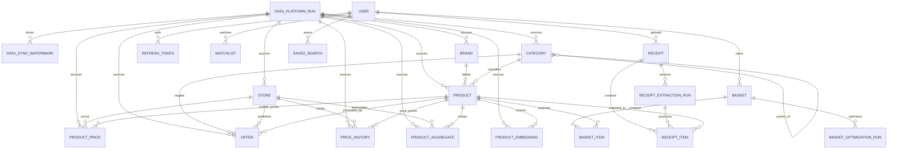

# PennyServ PostgreSQL Schema

## Foundation and Data-Platform Boundary

This schema intentionally separates two responsibilities:

- Upstream read-model mirror from `savebasket-data-platform`:
  - `data_platform_runs`, `data_sync_watermarks`
  - `stores`, `brands`, `categories`, `products`
  - `product_prices`, `offers`, `price_history`
  - `product_aggregates`, `product_embeddings`
- API-owned workflow state:
  - `users`, `refresh_tokens`, `watchlists`
  - `baskets`, `basket_items`, `basket_optimization_runs`
  - `receipts`, `receipt_extraction_runs`, `receipt_items`
  - `saved_searches`

Explicit non-goals for this API schema:

- No crawler/scraper orchestration tables
- No preprocessor job queue tables
- No upstream pipeline state-machine duplication
- No ownership of `savebasket-data-platform` ingestion lifecycle

## ERD



## Index Strategy

Read-heavy upstream mirrors:

- `products`: `ix_products_normalized_name`, `ix_products_taxonomy`, `ix_products_source_run`
- `product_prices`: `ix_product_prices_store_product`, `ix_product_prices_product_observed`, partial unique current-price index
- `offers`: `ix_offers_store_window`, `ix_offers_active`
- `price_history`: `ix_price_history_store_product_observed`
- `product_aggregates`: `ix_product_aggregates_product_store`
- `data_sync_watermarks`: `ix_data_sync_watermarks_last_synced`

API workflow paths:

- `watchlists`: `ix_watchlists_user_active`
- `baskets`: `ix_baskets_user_status`
- `basket_items`: `ix_basket_items_basket_selected`
- `basket_optimization_runs`: `ix_basket_optimization_runs_basket_started`
- `receipts`: `ix_receipts_user_purchased_at`
- `receipt_items`: `ix_receipt_items_matched_product`
- `saved_searches`: `ix_saved_searches_user_last_executed`

## Constraint Strategy

- Upstream identity constraints use natural upstream keys, for example `uq_products_upstream_product_id` and `uq_offers_upstream_offer_id`.
- API-owned idempotency and safety constraints include:
  - `uq_watchlists_user_product_store`
  - `uq_basket_items_basket_product`
  - `uq_receipt_items_receipt_line`
  - `uq_saved_searches_user_query`
- Numeric range and lifecycle checks are enforced via `CHECK` constraints for confidence scores, prices, and run windows.

## pgvector Integration

- Extension: `vector`
- Vector column: `product_embeddings.vector` with `vector(1536)`
- Approximate nearest-neighbor index:

```sql
CREATE INDEX ix_product_embeddings_vector_ivfflat
ON product_embeddings
USING ivfflat (vector vector_cosine_ops)
WITH (lists = 100);
```

## Data Sync Watermark Strategy

- One row per `(entity_name, scope_key)` in `data_sync_watermarks`.
- API ingestion process uses:
  - `upstream_cursor` for pagination/incremental token
  - `upstream_updated_at` for timestamp-based incremental sync
  - `last_success_run_id` for lineage to `data_platform_runs`
  - `sync_state` for provider-specific opaque metadata
- On successful sync, the watermark is atomically advanced after all entity writes commit.

## Seed and Reference Data Strategy

- `stores` is seeded as reference data from trusted upstream snapshots.
- Seeding is idempotent by `upstream_store_id` and `slug` constraints.
- API bootstrap may include a minimal default store list only for local/dev environments; production source of truth remains upstream.